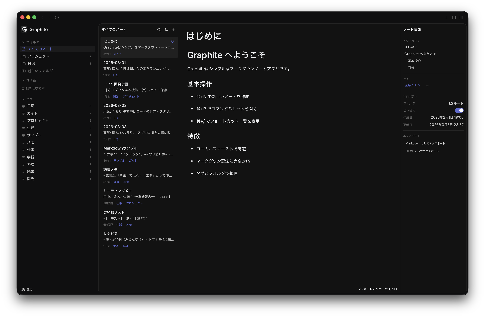

<p align="center">
  
</p>

<h1 align="center">Graphite</h1>

<p align="center">
  A local-first Markdown note-taking app built with Tauri
</p>

<p align="center">
  English | <a href="README.ja.md">日本語</a>
</p>

<p align="center">
  
</p>

## Why Graphite

| | Notion | Obsidian | Graphite |
|---|---|---|---|
| Works offline | Requires cloud | Yes | **Yes** |
| App size (macOS) | ~93 MB | ~283 MB | **18 MB** |
| Data format | Proprietary | Markdown | **Plain Markdown** |
| Vendor lock-in | Yes | Plugin ecosystem | **None** |

Your notes are plain `.md` files on your disk. No cloud, no account, no lock-in. Built with Tauri — not Electron — so it's lightweight and launches instantly.

## Features

- **Markdown editor** — Code highlighting, math (KaTeX), Mermaid diagrams
- **Folders & tags** — Organize and cross-reference your notes
- **Command palette** — `⌘P` to search notes and run commands
- **Keyboard-driven** — Vi / Emacs / Arrow keys, fully customizable
- **Multilingual** — English / Japanese
- **Cross-platform** — macOS / Windows / Linux

## Installation

### Homebrew (macOS)

```bash
brew install --cask bukamasedo/tap/graphite-notes
```

### Download

Grab the latest build from [Releases](https://github.com/bukamasedo/graphite/releases).

| Platform | File |
|----------|------|
| macOS (Apple Silicon) | `Graphite_x.x.x_aarch64.dmg` |
| macOS (Intel) | `Graphite_x.x.x_x64.dmg` |
| Windows | `Graphite_x.x.x_x64-setup.exe` / `.msi` |
| Linux (Debian/Ubuntu) | `graphite_x.x.x_amd64.deb` |
| Linux (AppImage) | `graphite_x.x.x_amd64.AppImage` |

## Development

### Prerequisites

- [Node.js](https://nodejs.org/) 20+ / [pnpm](https://pnpm.io/) 9+
- [Rust](https://www.rust-lang.org/tools/install) 1.75+
- [Tauri CLI](https://v2.tauri.app/start/prerequisites/)

```bash
pnpm install
pnpm tauri dev    # dev server
pnpm tauri build  # production build
```

### Project structure

```
src/                  # Frontend (React + TypeScript)
├── components/       # UI components
├── stores/           # Zustand stores
├── lib/api/          # Tauri invoke wrappers
└── i18n/             # i18n resources

src-tauri/            # Backend (Rust + Tauri)
├── src/commands/     # Tauri commands
├── src/models/       # Data models
└── src/utils/        # Utilities
```

### Tech stack

[Tauri 2](https://v2.tauri.app/) · [React 19](https://react.dev/) · [TypeScript](https://www.typescriptlang.org/) · [TipTap](https://tiptap.dev/) · [Zustand](https://zustand.docs.pmnd.rs/) · [Tailwind CSS](https://tailwindcss.com/) · [shadcn/ui](https://ui.shadcn.com/) · [Biome](https://biomejs.dev/)

## License

[MIT](LICENSE)
